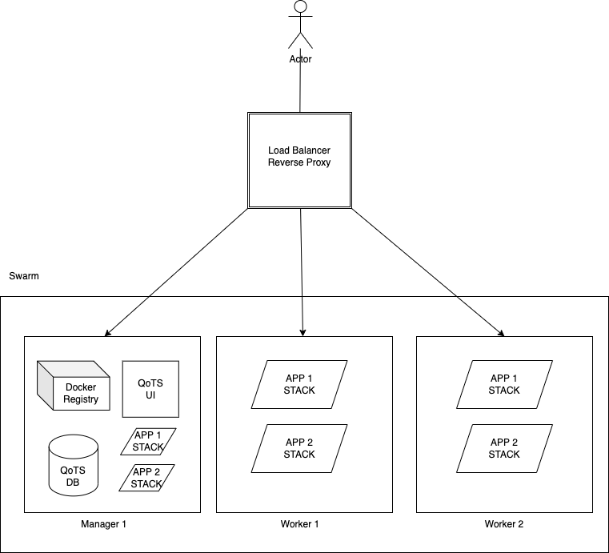

# Queen of The Swarm

A scalable Platform as a service based on docker swarm.

## What is this?

Queen of The Swarm is a platform as a service based on docker swarm. It is designed to be

- Scalable.
- Easy to use.
- Easy to install and configure.
- Used on a single machine or on multiple machines.
- Use a load balancer and a reverse proxy with rate limiting.
- Use a docker registry.

## How does it work?

Queen of The Swarm is a CLI tool that installs and configures a docker swarm, a docker registry, a docker registry UI and a load balancer. It also provides a UI to manage the swarm and the registry.

## How to use it?

### Requirements

- A machine for the load balancer/reverse proxy.
- A machine with at least 2GB of RAM and 2 CPU cores (for the swarm manager and workers).
- A domain name.
- A DNS server that supports wildcard subdomains.
- Multiple machines if you want to use the swarm on multiple machines.

### Installation

TBD

### Usage

TBD

## How does it work?

### Architecture

### Components

#### Docker Swarm

Docker swarm is a container orchestration tool that allows you to run containers on multiple machines. It is composed of a manager and workers. The manager is responsible for managing the workers and the workers are responsible for running the containers.

#### Docker Registry

Docker registry is a tool that allows you to store docker images. It is used to store the images that are used by the swarm.

#### Docker Registry UI

Docker registry UI is a tool that allows you to manage the docker registry. It is used to manage the images that are used by the swarm.

#### Load Balancer

Load balancer is a tool that allows you to distribute the load between multiple machines. It is used to distribute the load between the swarm manager and the swarm workers.

#### Reverse Proxy

Reverse proxy is a tool that allows you to route the traffic to the correct machine. It is used to route the traffic to the swarm manager and the swarm workers.

#### Certbot

Certbot is a tool that allows you to generate SSL certificates. It is used to generate SSL certificates for the load balancer.

## Whats in this repository?

### CLI

The CLI (`./apps/cli`) is a tool that allows you to install and configure the swarm, the registry, the registry UI, the load balancer and the reverse proxy.

### UI

The UI(`./apps/web`) is a tool that allows you to manage the swarm and the registry.

### Documentation

The documentation(`./apps/docs`) is a tool that allows you to learn how to use the CLI and the UI.

## Roadmap

- [ ] Configure repository.
  - [ ] Create a repository.
  - [ ] Create a README.
  - [ ] Create a LICENSE.
  - [ ] Create CI/CD for the CLI.
  - [ ] Create CI/CD for the UI.
  - [ ] Create CI/CD for the documentation.
- [ ] Documentation.
  - [ ] Create a documentation with github pages.
  - [ ] Create a documentation for the CLI.
  - [ ] Create a documentation for the UI.
  - [ ] Create a documentation for the architecture.
  - [ ] Create a documentation for the components.
  - [ ] Create a documentation for the installation.
  - [ ] Create a documentation for the usage.
- [ ] Installer CLI.
  - [ ] Brings up the database, load balancer and the UI.
  - [ ] Installs docker and initialises the swarm (manager).
  - [ ] Installs and configures a docker registry.
  - [ ] Installs and configures a docker registry UI.
  - [ ] Installs and configures a docker registry proxy/load balancer.
  - [ ] Configures certbot for the load balancer.
  - [ ] Installs docker on a remote machine and joins it to the swarm (worker) (if needed).
  - [ ] Upgrades the swarm if needed and when it is needed.
- [ ] Database
  - [ ] Store the swarm information.
  - [ ] Store UI information.
- [ ] UI
  - [ ] Create a UI for the swarm.
  - [ ] Create a UI for the registry.
  - [ ] Create an authentication system.
